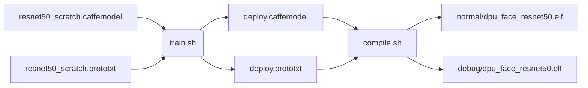
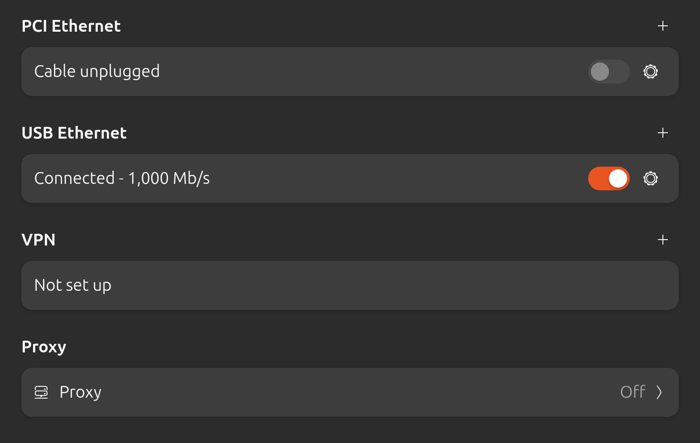
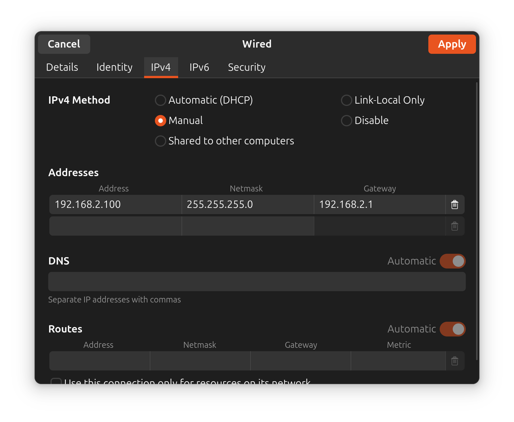
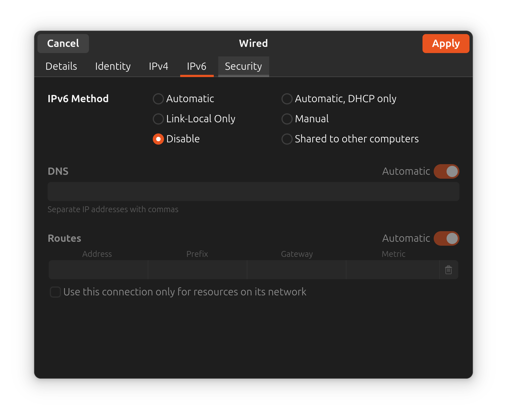
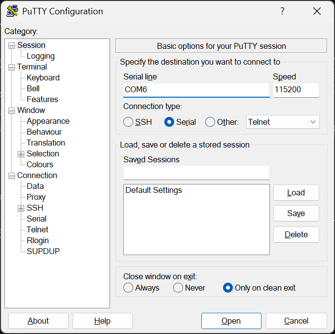

# Host
The host has 2 roles:
- compile the model for the DPU IP (if you do not have the final binary yet)
- communicate with the board

> **IMPORTANT**
> Before proceeding to the compile flow, ensure you have already built the Docker container in your preferred mode (cpu or gpu).

The flow to compile the ResNet50 model from scratch is the following:


# From Caffe to binary

## Requirements
- `dnndk-container` built and started on your host

## Quantization
Once inside the container, run:
```
cd ~/models/resnet50/quantization
./quant.sh
```
If everything went correctly, you will find:
- `.../quantization/quantize_results/deploy.prototxt`
- `.../quantization/quantize_results/deploy.caffemodel`

## Compilation

> **WARNING**
> Not all models can be compiled. Constraints are very strict, so carefully read the compiling section before proceeding.

### Supported layers
A deep learning model such as ResNet50 is a stack of layers that together form the complete network. The DPU v1.4 synthesised for the PynqZ2 board is quite small and has very limited available memory. Most modern and faster layer types require more memory, making them impossible to compile for this target by design. Models such as MobileFaceNet, UltraFace, MTCNN, etc. require very tricky workarounds to compile correctly in this environment.
For this reason, ResNet50 was chosen. It is one of the very few models tested with DNNDK v3.1, and at the same time it is very good at feature extraction, even for faces.

Here is the list of supported layers (output of `dexplorer -w`):

```terminal
root@pynqz2_dpu:~# dexplorer -w
[DPU IP Spec]
IP  Timestamp            : 2023-05-15 10:15:00
DPU Core Count           : 1

[DPU Core Configuration List]
DPU Core                 : #0
DPU Enabled              : Yes
DPU Arch                 : B1152
DPU Target Version       : v1.4.0
DPU Freqency             : 150 MHz
Ram Usage                : Low
DepthwiseConv            : Enabled
DepthwiseConv+Relu6      : Enabled
Conv+Leakyrelu           : Enabled
Conv+Relu6               : Enabled
Channel Augmentation     : Enabled
Average Pool             : Enabled
```


To recompile the model, run:
```
cd ~/models/resnet50/compilation
./compile.sh
```
This script produces two `.elf` files: one in normal mode and one in debug mode.

> **NOTE**
> 
> **debug**: the layers of the network model run one by one under the scheduling of N2Cube. With the help of DExplorer, users can perform debugging or performance profiling for each layer of the DPU kernel compiled in debug mode.
>
> **normal**: all layers of the network model are packaged into a single DPU execution unit, with no interrupts involved during execution. Compared with debug mode, the normal mode DPU kernel delivers better performance and should be used during the production release phase.


# Networking

## Requirements
- putty
- ssh
- git bash (ONLY WINDOWS)

The OS running on the board is an instance of PetaLinux 2019.2, which is based on the [Yocto Project](https://en.wikipedia.org/wiki/Yocto_Project). The main networking manager is therefore `BusyBox init` (PID 1), which reads the networking configuration from `/etc/network/interfaces`.
For basic usage of the board, a **static IP** configuration is used with address `192.168.2.99`. Follow these steps to set up the SSH connection:
- power on the board and connect it to your PC (direct Ethernet port or via adapter)
    If you've connected board and PC via adapter there are several differences between OS (direct Ethernet is right now untested)
    ### Linux
    - normally for the board, tty interface in linux is `ttyUSB1`, so check if it exists
    ```
    sudo dmesg | grep ttyUSB1
    ```
    - then install `gtkterm` command gui if there isn't. For instance on Ubuntu
    ```
    sudo apt install gtkterm
    ```
    -select _baud rate 115200_ and try all `ttyUSBx` until it works (remember to type <kbd>Enter</kbd>)
    - open your gui distro network setting and configure usb ethernet
        
    - go to ipv6 setting e set these addresses
        
    - and disable ipv6
        
    ### Windows
    - open PuTTY and set up a new connection as shown in the following image 
    - press <kbd>Win</kbd>+<kbd>r</kbd> and digit `ncpa.cpl`
    - go to ethernet -> property -> (TCP/IPv4) and set same addresses as in linux ipv4 case
- when terminal is ready, press <kbd>Enter</kbd>
- run:
    ```
    vim /etc/network/interfaces
    ```
- then modify the file to match the following:
    ```
    # /etc/network/interfaces -- configuration file for ifup(8), ifdown(8)
    # The loopback interface
    auto lo
    iface lo inet loopback
    # Wireless interfaces
    iface wlan0 inet dhcp
            wireless_mode managed
            wireless_essid any
            wpa-driver wext
            wpa-conf /etc/wpa_supplicant.conf
    iface atml0 inet dhcp
    # Wired or wireless interfaces
    auto eth0
    # ---------------- INSERT THIS ----------------------
    iface eth0 inet static
            address 192.168.2.99
            gateway 255.255.255.0
            network 192.168.2.1
            broadcast 192.168.2.255
    # ----------------------------------------------------
    iface eth1 inet dhcp
    # Ethernet/RNDIS gadget (g_ether)
    # ... or on host side, usbnet and random hwaddr
    iface usb0 inet static
            address 192.168.7.2
            netmask 255.255.255.0
            network 192.168.7.0
            gateway 192.168.7.1
    # Bluetooth networking
    iface bnep0 inet dhcp
    ```
- save with the `:wq` vim command (press <kbd>i</kbd> to enter `INSERT` mode; <kbd>Esc</kbd> to return to `NORMAL` mode)
- on your host, edit `~/.ssh/config` and add the following entry if it does not exist yet:
    ```
    Host pz2
    	HostKeyAlgorithms +ssh-rsa
    	PubkeyAcceptedAlgorithms +ssh-rsa
        User root
        IdentityFile ~/.ssh/id_rsa
        HostName <pynq ip>
    ```
    <pynq ip> is `192.168.2.99` if you are following networking guide
- then, open terminal (or Git Bash if you're using WINDOWS) and then run these commands only if your system does not have an rsa key yet
    ```
    ssh-keygen -t rsa
    ssh-copy-id -i ~/.ssh/id_rsa.pub pz2
    ```
- reboot the board
- on your host terminal, run:
    ```
    ssh pz2
    ```
    to connect to the board shell

## Terminal emulator
For normal usage use whatever you want. If you have correctly configured ssh host `ssh pz2` should work.

If you want debug for example saved cropped images used for SVM training or just navigate among folders with GUI visual (SFTP panel) and having a running terminal at same time, you can use [MobaXterm](https://mobaxterm.mobatek.net/) (ONLY WINDOWS). There linux alternaties like [muon ssh](https://github.com/devlinx9/muon-ssh/tree/master) or [termius](https://termius.com/download/linux) but are untested right now.

### Pure terminal way on Linux
On linux, using [`sshfs`](https://github.com/libfuse/sshfs) it is possible to mount a remote folder over ssh. So, install it and run `pz2mnt.sh` script (inside `cloned_project/host/utils/linux/`). Then, any _explorer_ (sush as Nautilus for Ubuntu) should show that remote folder.

> **IMPORTANT**
> Script assume you've correctly written `~./ssh/config` file like before

> **WARNING**
> Right now, `sshfs` is barely mainteined. Mainteiner just accept PRs to resolve minor fix, but major features are no more implemented or published

Rest of task such as `./main` command or other stuff could be launched from any terminal


# References
- [vim cheatsheet](https://vim.rtorr.com/)
- [petalinux 2019.2 guide](https://docs.amd.com/v/u/2019.2-English/ug1144-petalinux-tools-reference-guide)
- [ssh config manual](https://linux.die.net/man/5/ssh_config)
